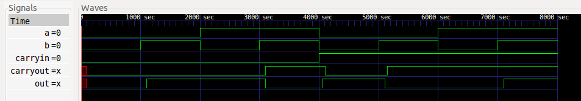
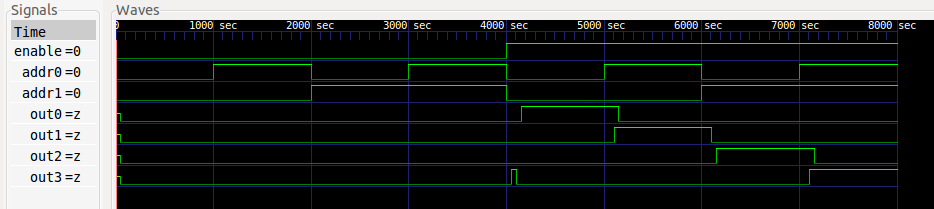
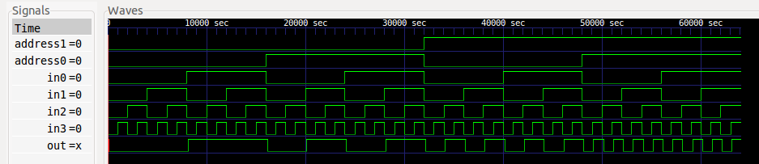

# HW2 Results

### Adder

```
A B Ci | Co S | Expected Output
0 0  0 |  0 0 | Both False
0 1  0 |  0 1 | Sum True
1 0  0 |  0 1 | Sum True
1 1  0 |  1 0 | CarryOut True
0 0  1 |  0 1 | Sum True
0 1  1 |  1 0 | CarryOut True
1 0  1 |  1 0 | CarryOut True
1 1  1 |  1 1 | Both True
```

### Decoder

```
En A0 A1 | O0 O1 O2 O3 | Expected Output
 0  0  0 |  0  0  0  0 | All False
 0  1  0 |  0  0  0  0 | All False
 0  0  1 |  0  0  0  0 | All False
 0  1  1 |  0  0  0  0 | All False
 1  0  0 |  1  0  0  0 | O0 True
 1  1  0 |  0  1  0  0 | O1 True
 1  0  1 |  0  0  1  0 | O2 True
 1  1  1 |  0  0  0  1 | O3 True
```

### Multiplexer

```
Concise Table:
A1 A0 | I0 I1 I2 I3 | O | Expected Output
 0  0 |  X  X  X  X | X | Input 0
 0  1 |  X  X  X  X | X | Input 1
 1  0 |  X  X  X  X | X | Input 2
 1  1 |  X  X  X  X | X | Input 3
```
```
Full Table:
A1 A0 | I0 I1 I2 I3 | O | Expected Output
 0  0 |  0  0  0  0 | 0 | Input 0
 0  0 |  0  0  0  1 | 0 | Input 0
 0  0 |  0  0  1  0 | 0 | Input 0
 0  0 |  0  0  1  1 | 0 | Input 0
 0  0 |  0  1  0  0 | 0 | Input 0
 0  0 |  0  1  0  1 | 0 | Input 0
 0  0 |  0  1  1  0 | 0 | Input 0
 0  0 |  0  1  1  1 | 0 | Input 0
 0  0 |  1  0  0  0 | 1 | Input 0
 0  0 |  1  0  0  1 | 1 | Input 0
 0  0 |  1  0  1  0 | 1 | Input 0
 0  0 |  1  0  1  1 | 1 | Input 0
 0  0 |  1  1  0  0 | 1 | Input 0
 0  0 |  1  1  0  1 | 1 | Input 0
 0  0 |  1  1  1  0 | 1 | Input 0
 0  0 |  1  1  1  1 | 1 | Input 0
 0  1 |  0  0  0  0 | 0 | Input 1
 0  1 |  0  0  0  1 | 0 | Input 1
 0  1 |  0  0  1  0 | 0 | Input 1
 0  1 |  0  0  1  1 | 0 | Input 1
 0  1 |  0  1  0  0 | 1 | Input 1
 0  1 |  0  1  0  1 | 1 | Input 1
 0  1 |  0  1  1  0 | 1 | Input 1
 0  1 |  0  1  1  1 | 1 | Input 1
 0  1 |  1  0  0  0 | 0 | Input 1
 0  1 |  1  0  0  1 | 0 | Input 1
 0  1 |  1  0  1  0 | 0 | Input 1
 0  1 |  1  0  1  1 | 0 | Input 1
 0  1 |  1  1  0  0 | 1 | Input 1
 0  1 |  1  1  0  1 | 1 | Input 1
 0  1 |  1  1  1  0 | 1 | Input 1
 0  1 |  1  1  1  1 | 1 | Input 1
 1  0 |  0  0  0  0 | 0 | Input 2
 1  0 |  0  0  0  1 | 0 | Input 2
 1  0 |  0  0  1  0 | 1 | Input 2
 1  0 |  0  0  1  1 | 1 | Input 2
 1  0 |  0  1  0  0 | 0 | Input 2
 1  0 |  0  1  0  1 | 0 | Input 2
 1  0 |  0  1  1  0 | 1 | Input 2
 1  0 |  0  1  1  1 | 1 | Input 2
 1  0 |  1  0  0  0 | 0 | Input 2
 1  0 |  1  0  0  1 | 0 | Input 2
 1  0 |  1  0  1  0 | 1 | Input 2
 1  0 |  1  0  1  1 | 1 | Input 2
 1  0 |  1  1  0  0 | 0 | Input 2
 1  0 |  1  1  0  1 | 0 | Input 2
 1  0 |  1  1  1  0 | 1 | Input 2
 1  0 |  1  1  1  1 | 1 | Input 2
 1  1 |  0  0  0  0 | 0 | Input 3
 1  1 |  0  0  0  1 | 1 | Input 3
 1  1 |  0  0  1  0 | 0 | Input 3
 1  1 |  0  0  1  1 | 1 | Input 3
 1  1 |  0  1  0  0 | 0 | Input 3
 1  1 |  0  1  0  1 | 1 | Input 3
 1  1 |  0  1  1  0 | 0 | Input 3
 1  1 |  0  1  1  1 | 1 | Input 3
 1  1 |  1  0  0  0 | 0 | Input 3
 1  1 |  1  0  0  1 | 1 | Input 3
 1  1 |  1  0  1  0 | 0 | Input 3
 1  1 |  1  0  1  1 | 1 | Input 3
 1  1 |  1  1  0  0 | 0 | Input 3
 1  1 |  1  1  0  1 | 1 | Input 3
 1  1 |  1  1  1  0 | 0 | Input 3
 1  1 |  1  1  1  1 | 1 | Input 3
```
