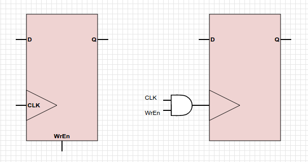

## HW4 Deliverables

#### Joey Maalouf

### 1

### 6
Our enable input is a single bit, either 0 or 1. The address is a 5-bit number representing a value between 0 and 31 (inclusive).
When we shift the enable left by the address, we create a one-hot representation (if enable is 1) where every value is 0 except the one we want (the bit specified by the address value). If enable is 0, every bit is 0 and our decoder outputs all false.
