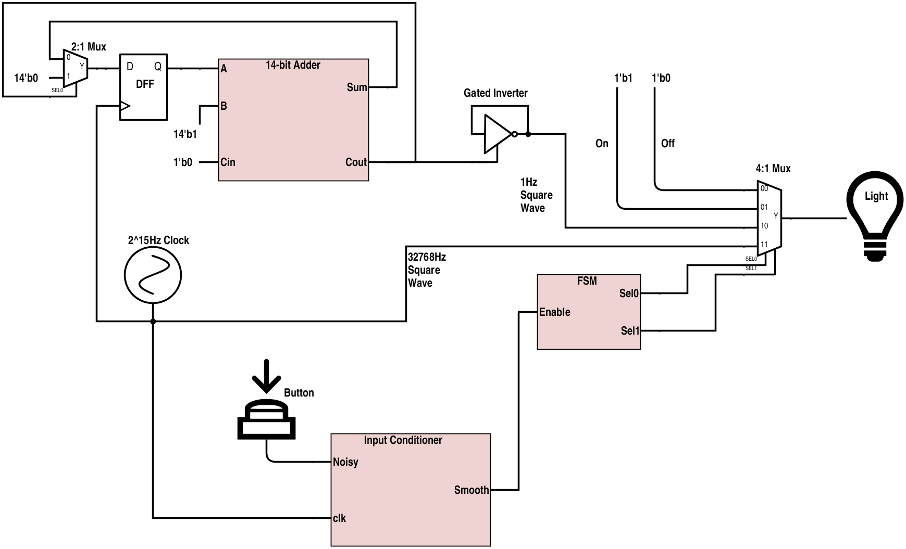

# Block Diagram

Our LED has 4 possible outputs, so we use a 4:1 multiplexer to choose between them. The selection is done by the finite state machine, the state of which changes with every (input-conditioned) button press.

The "off" option is represented by a constant power of 0.

The "on" option is represented by a constant power of 1.

The "blink" option is represented by a 1Hz square wave oscillating between 0 and 1 with a 50% duty cycle. In order to get a 1Hz clock, we create an inverter that feeds into itself and is gated by a signal that fires high for one cycle, twice per second. Since our only clock runs at 32768Hz, we need to fire every 16384 cycles. To do that, we can increment a counter value by 1 every cycle until it hits that limit. Since 16384 is 2^14, we can just make our adder 14 bits wide and check for when it yields a carryout value. When it does, we fire our gating enable, and we reset the counter value to 0 with a 2:1 mux. The adder is timed to the clock through a D-flip-flop.

The "dim" option is represented by a 32768Hz square wave oscillating between 0 and 1 with a 50% duty cycle. At such a high frequency, the human eye can't discern the individual cycles and blends the on and off states together into a "dim" light.
