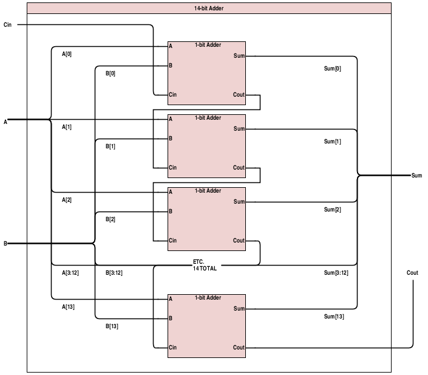

# Schematics

### 14-bit Adder

##### Specification
This component takes in two 14-bit binary numbers, as well as a carry-in bit, and adds them together. It produces a 14-bit sum output, as well as a carry-out bit. Because it is composed internally of 14 chained 1-bit adders, that schematic is included below as well.

##### Inputs
* A, 14 bits
* B, 14 bits
* Cin, 1 bit

##### Outputs
* Sum, 14 bits
* Cout, 1 bit

##### Schematic

##### Gate Inputs
| Component   | Cost Per | # Used | Subtotal |
|-------------|----------|--------|----------|
| 1-bit Adder | 10       | 14     | 140      |
Total: **140** GIE

### Input Conditioner

##### Specification
This component takes in a (potentially) noisy serial signal and filters out any noise/instability by only letting the signal go through when it stays the same value for 33 clock cycles (just over 1ms) in a row.

##### Inputs
* Noisy, 1 bit
* clk, 1 bit

##### Outputs
* Smooth, 1 bit

##### Schematic
...

##### Gate Inputs
...

### Finite State Machine

##### Specification
This component takes in an enable signal and, when it is high, steps through the potential states. It outputs the mux selection values for its current state.

##### Inputs
* Enable, 1 bit

##### Outputs
* Sel0, 1 bit
* Sel1, 1 bit

##### Schematic

##### Gate Inputs
| Component            | Cost Per | # Used | Subtotal |
|----------------------|----------|--------|----------|
| 4-stage ring counter | 83       | 1      | 83       |
| OR gate              | 3        | 2      | 6        |
| 2:1 mux              | 7        | 2      | 14       |
Total: **103** GIE
