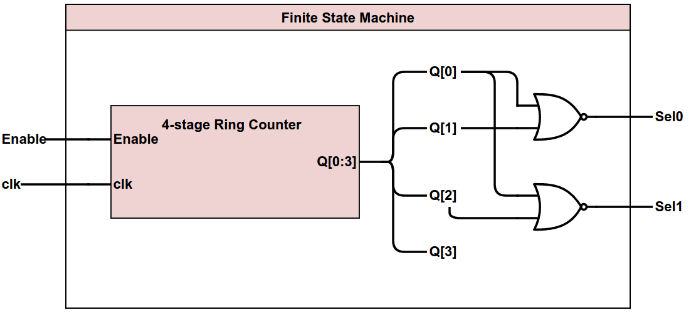

# Schematics

### 1-bit Adder

##### Specification
This component takes in two 1-bit binary numbers, as well as a carry-in bit, and adds them together. It produces a 1-bit sum output, as well as a carry-out bit.

##### Inputs
* A, 1 bit
* B, 1 bit
* Cin, 1 bit

##### Outputs
* Sum, 1 bit
* Cout, 1 bit

##### Schematic

##### Gate Inputs
| Component | Cost Per | # Used | Subtotal |
|-----------|----------|--------|----------|
| XOR Gate  | 3        | 2      | 6        |
| AND Gate  | 3        | 2      | 6        |
| OR Gate   | 3        | 1      | 3        |
Total: **15** GIE

### 14-bit Adder

##### Specification
This component takes in two 14-bit binary numbers, as well as a carry-in bit, and adds them together. It produces a 14-bit sum output, as well as a carry-out bit.

##### Inputs
* A, 14 bits
* B, 14 bits
* Cin, 1 bit

##### Outputs
* Sum, 14 bits
* Cout, 1 bit

##### Schematic

##### Gate Inputs
| Component   | Cost Per | # Used | Subtotal |
|-------------|----------|--------|----------|
| 1-bit Adder | 15       | 14     | 210      |
Total: **210** GIE

### Input Conditioner

##### Specification
This component takes in a (potentially) noisy serial signal and filters out any noise/instability by only letting the signal go through when it stays the same value for 33 clock cycles (just over 1ms). Any cycles in which the values are the same increment a counter, while any cycles in which the values are different do nothing. When the counter reaches 33, it allows the signal to pass through.

##### Inputs
* Noisy, 1 bit
* clk, 1 bit

##### Outputs
* Smooth, 1 bit

##### Schematic

##### Gate Inputs
| Component             | Cost Per | # Used | Subtotal |
|-----------------------|----------|--------|----------|
| 33-Stage Ring Counter | 692      | 1      | 692      |
| D-Flip-Flop           | 13       | 2      | 26       |
| JK-Flip-Flop          | 10       | 1      | 10       |
| XNOR Gate             | 2        | 1      | 2        |
| Inverter              | 1        | 1      | 1        |
| Gated Buffer          | 2        | 1      | 2        |
Total: **733** GIE

### Finite State Machine

##### Specification
This component takes in an enable signal and, when it is high, steps through the potential states. It outputs the mux selection values for its current state.

##### Inputs
* Enable, 1 bit
* clk, 1 bit

##### Outputs
* Sel0, 1 bit
* Sel1, 1 bit

##### Schematic

##### Gate Inputs
| Component            | Cost Per | # Used | Subtotal |
|----------------------|----------|--------|----------|
| 4-Stage Ring Counter | 83       | 1      | 83       |
| NOR Gate             | 2        | 2      | 4        |
Total: **87** GIE
