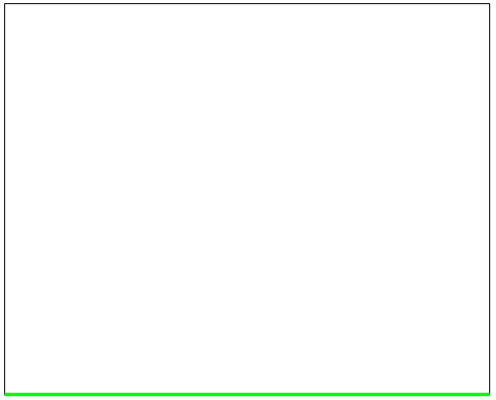
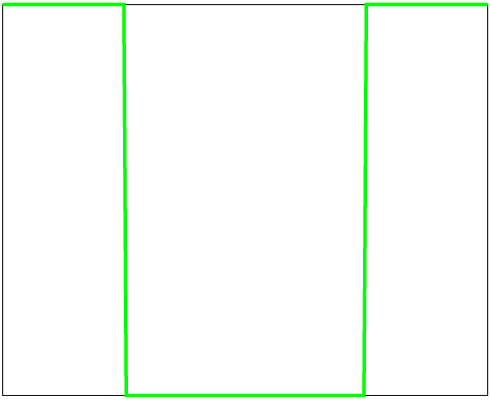
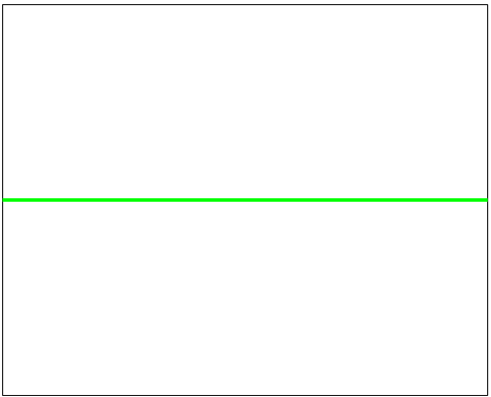
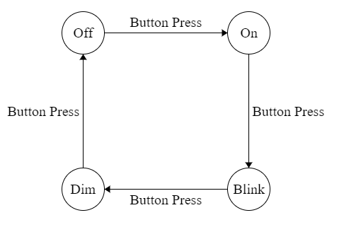

# Specification Document

### Inputs and Outputs

| Device | Type   |
|--------|--------|
| Button | Input  |
| LED    | Output |

### Operational Modes

Light power level over time:

##### Off

##### On

##### Blinking

##### Dim

### Measurements

When the mode is set to blinking, the light will cycle once per second, giving us a blink rate of 1Hz.

### Finite State Machine

The light has 4 possible patterns, each with a unique set of flags for the light level, so we create a state for each one. The flow is very simple; with each new button press, we cycle through to the next state.

| State | Light Power Level | Next State |
|-------|-------------------|------------|
| Off   | 0                 | On         |
| On    | 1                 | Blink      |
| Blink | 1, 0, 1, 0, ...   | Dim        |
| Dim   | 0.5               | Off        |
